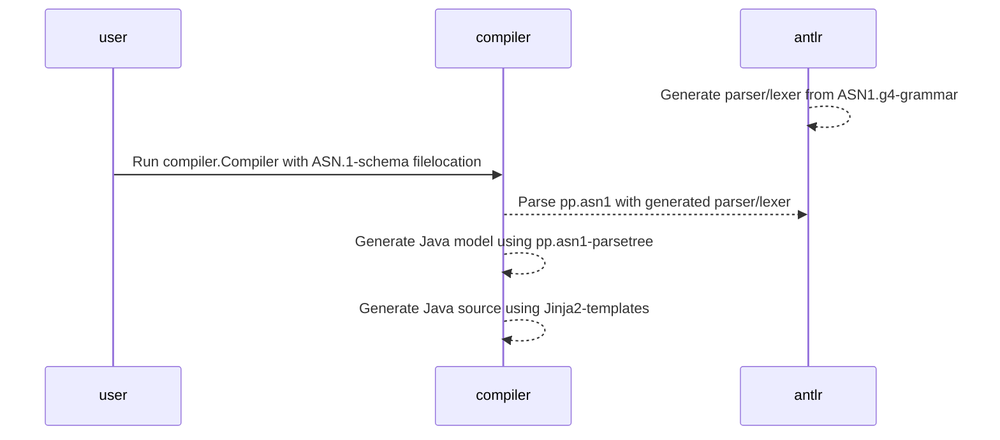

# ASN.1-compiler for the Polymorphic Pseudonymization-schema (PP-schema)

Generates Java-bindings for the pp.asn1-schema:

```
.
├── asn1-antlr                  --> ANTLR lexer/parser generator 
├── asn1-compiler               --> Binding generator for pp.asn1-schema
├── asn1-pp                     --> Example project using asn1-compiler
```

Usage is limited to a very specific pp.asn1-schema use case:
- Client code should only handle data assumed to be DER-encoded
- Only constructs from the supported pp.asn1-schema is supported
- Generated code solely uses BouncyCastle to handle ASN.1-data.
 
As of timing of writing this compiler supports the schema published at:
- https://wiki.bsn-koppelregister.nl/download/attachments/46760226/pp-v2.asn1?api=v2

## Prerequisites

- Linux environment (others untested)
- Maven 3.6.3
- Java 11.0.6

## Workflow

The project assumes the user wants to generated Java-bindings for the pp.asn1-schema:  



## Basic usage

Run maven install: 

```shell script
mvn clean install
```

This will:
- 'asn1-antlr' containing the lexer/parser for [asn1-antlr/src/main/resources/ASN1.g4] 
- 'asn1-compiler' that can generate java bindings using 'asn1-antlr'
- 'asn1-pp' containing the default/example generated code (only)  

## Code generation

ASN.1 is an overly complex syntax. Luckily the pp.schema only uses a limited subset
of its features.

The 'asn1-compiler' compiles a supplied schema to source files by:
1. Visiting the ANTLR4 parse tree and building a model from it
2. Writing out the model using Jinja templates located in [asn1-compiler/src/main/resources/jinja/]

Source code is generated into the 'generated.asn1'-package: this is not configurable yet.

## Integrating into a build

No maven plugin is built. The compiler can be added to a maven build simply calling the
compiler.Compiler-main method with the 'exec-maven-plugin'. 

## Customizing

The pp-asn1-compiler supports adding arbitrary interfaces which do not have to 
be present during code generation, as to avoid modifying the code generation
itself and add behaviours through externally defined interfaces.

The mapping is specified through the system property 'asn1.compiler.class.interfaces'
which should be the absolute path to the mapping file.

An example of this usage can be seen the in example 'asn1-pp'-module which 
generates the default bindings without any custom interfaces.

```xml
      <plugin>
        <groupId>org.codehaus.mojo</groupId>
        <artifactId>exec-maven-plugin</artifactId>
        <executions>
          <execution>
            <phase>generate-sources</phase>
            <goals>
              <goal>java</goal>
            </goals>
          </execution>
        </executions>
        <configuration>
          <includeProjectDependencies>true</includeProjectDependencies>
          <includePluginDependencies>true</includePluginDependencies>
          <mainClass>compiler.Compiler</mainClass>
          <arguments>
            <argument>${project.basedir}/target/generated-sources</argument>
            <argument>${project.basedir}/src/main/resources/pp.asn1</argument>
          </arguments>
          <systemProperties>
            <systemProperty>
              <key>asn1.compiler.class.interfaces</key>
              <value>${project.basedir}/src/main/resources/pp.asn1.interfaces.yaml</value>
            </systemProperty>
          </systemProperties>
        </configuration>
```

## Add custom interfaces to generated code

The interfaces-mapping is a YAML-file which is a mapping of entries, such as:

```
{{ asn1-type-java-class-simple-name }}:
  - {{ java-interface-name-1 }}
  - {{ java-interface-name-2 }}
```

The Jinja2-templater reads the mapping and looks them up during templating such as in
this excerpt below:

```jinja


public class {{ __jclass_identifier__ }}
        implements ASN1Encodable
        
        , {{ jinterface }}
         {
```

A mapping such as below would add nl.logius.pepcrypto.lib.asn1.signedencryptedpseudonym.Asn1SignedEncryptedPseudonymEnvelope
as an interface for the generated 'generated.asn1.SignedEncryptedPseudonym'-source file. 

```yaml
SignedEncryptedPseudonym:
  - nl.logius.pepcrypto.lib.asn1.signedencryptedpseudonym.Asn1SignedEncryptedPseudonymEnvelope
```
 
--
